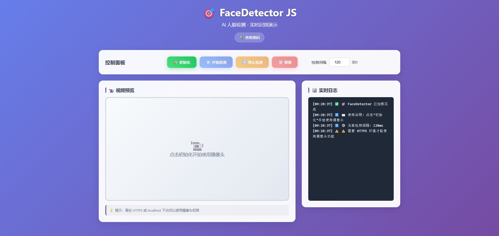

# face-detector-lite

基于 TensorFlow.js 与 BlazeFace 的轻量级浏览器人脸检测库，默认内置模型与依赖，适用于现代 Web 项目与 Vue 3。

[](https://www.npmjs.com/package/face-detector-lite)
[](https://www.npmjs.com/package/face-detector-lite)
[](https://opensource.org/licenses/MIT)

## 在线体验
<div align="center">
  
  <p><em>浏览器端实时检测演示界面</em></p>
</div>

- 演示站点：https://doudou-start.github.io/face-detector/
- CDN 加载：
  - jsDelivr：https://cdn.jsdelivr.net/npm/face-detector-lite/dist/face-detector.standalone.min.js
  - unpkg：https://unpkg.com/face-detector-lite/dist/face-detector.standalone.min.js
- npm 安装：`npm install face-detector-lite`

## 功能亮点
- **纯前端运行**：无需后端服务，支持完全离线环境。
- **即开即用**：包内自带 TF.js、BlazeFace 与模型文件，无需额外下载。
- **接口简洁**：链式事件、易理解的配置项，兼容 TypeScript。
- **Vue 支持**：提供现成的 Vue 3 组件与插件包装。

## 快速开始

### 通过 CDN
```html
<script src="https://cdn.jsdelivr.net/npm/face-detector-lite/dist/face-detector.standalone.min.js"></script>
<script>
  const detector = new FaceDetector({ showVideo: true })
    .onFaceDetected(() => console.log('检测到人脸'))
    .onNoFace(() => console.log('未检测到人脸'));

  await detector.initialize();
  detector.startDetection();
</script>
```

### 通过 ESM
```html
<script type="module">
  import FaceDetector from 'https://cdn.jsdelivr.net/npm/face-detector-lite/+esm';

  const detector = new FaceDetector({ showVideo: true });
  await detector.initialize();
  detector.startDetection();
</script>
```

### 通过 npm
```bash
npm install face-detector-lite
```
```js
import FaceDetector from 'face-detector-lite';

const detector = new FaceDetector({
  showVideo: true,
  // libUrls: { tf: '/node_modules/face-detector-lite/libs/tf.min.js', blazeface: '/node_modules/face-detector-lite/libs/blazeface.js' },
  // modelUrl: '/node_modules/face-detector-lite/models/blazeface/model.json'
});

await detector.initialize();
detector.startDetection();
```
> 默认 `offlineOnly = true`。若希望自动回落到 CDN，可显式设置 `offlineOnly: false`。

## Vue 3 集成
```js
import { FaceDetectorView } from 'face-detector-lite/vue';
// 或 import FaceDetectorPlugin from 'face-detector-lite/vue';
//    app.use(FaceDetectorPlugin);
```
```vue
<template>
  <FaceDetectorView
    class="preview"
    @initialized="onReady"
    @detected="onDetected"
    @no-face="onNoFace"
    @error="onError"
  />
</template>
```

> 组件默认会隐藏视频 (`show-video=false`)、渲染一个占位容器 (`render-container=true`)，并在挂载完成后自动开始检测 (`start-on-mounted=true`)。

如需自定义行为，可传入对应属性：

```vue
<FaceDetectorView
  :show-video="true"
  :render-container="false"
  :start-on-mounted="false"
  :interval="150"
  :camera="{ facingMode: 'environment', width: 1280, height: 720 }"
  @initialized="onReady"
  @detected="onDetected"
  @no-face="onNoFace"
  @error="onError"
/>
```

## API 概览
### 构造函数
```js
new FaceDetector(options?)
```
**常用配置**
- `showVideo`：是否渲染摄像头画面，默认 `false`。
- `videoContainer`：自定义视频容器，可为选择器或 DOM 实例。
- `interval`：检测间隔（毫秒），默认 `100`。
- `modelUrl`：自定义模型地址，默认加载内置模型。
- `libUrls`：自定义 TF.js / BlazeFace 资源路径。
- `offlineOnly`：是否禁止访问 CDN，默认 `true`。
- `camera`：摄像头参数 `{ facingMode, width, height }`。

**实例方法**
- `initialize()`：初始化摄像头与模型。
- `startDetection()` / `stopDetection()`：开始或停止检测。
- `detectFace()`：执行一次检测，返回是否识别到人脸。
- `destroy()`：释放摄像头与模型资源。

**事件链式调用**
- `onInitialized(fn)`、`onFaceDetected(fn)`、`onNoFace(fn)`、`onError(fn)`。

## 运行模式说明
- **npm / Bundler**：默认使用包内 `libs/` 与 `models/` 资源；可改写 `libUrls`、`modelUrl` 指向自托管路径。
- **CDN 版本**：`dist/face-detector.standalone.min.js` 已自带所有依赖，直接插入 `<script>` 即可。
- **离线部署**：保持默认 `offlineOnly = true`，包内资源会本地加载；缺失时会抛错，以免静默访问外部网络。

## 常见问题
- **版本号发布**：执行 `npm run version:patch|minor|major` 更新版本，再运行 `npm run release` 发布。
- **权限要求**：需在 HTTPS 或 localhost 下运行并获得摄像头权限。
- **SSR 使用**：在浏览器钩子中延迟实例化，避免服务端渲染阶段访问 `window` 或 `navigator`。

## 本地开发
```bash
npm install
npm run build
```
构建产物位于 `dist/`，其中 `face-detector.standalone.min.js` 为自包含版本。

## 许可证
MIT License © [DouDOU-start](https://github.com/DouDOU-start)
